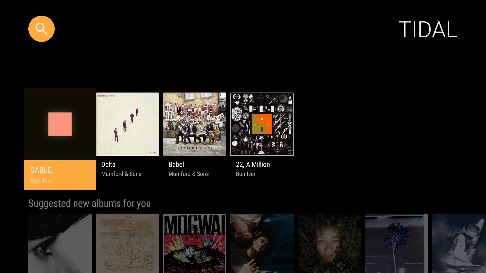
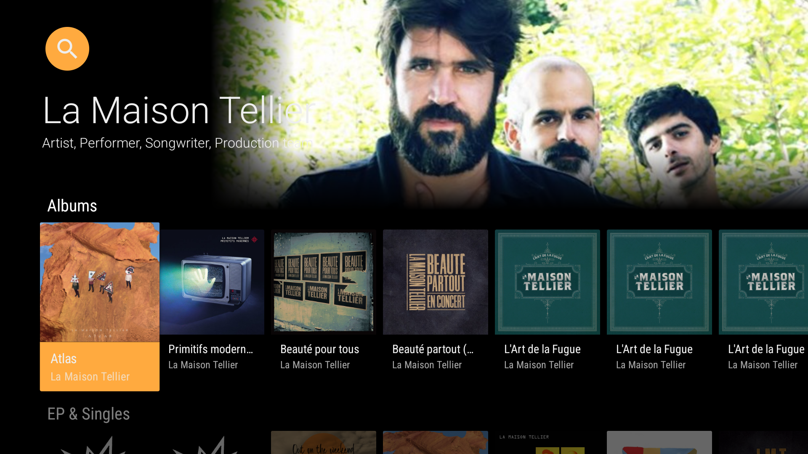
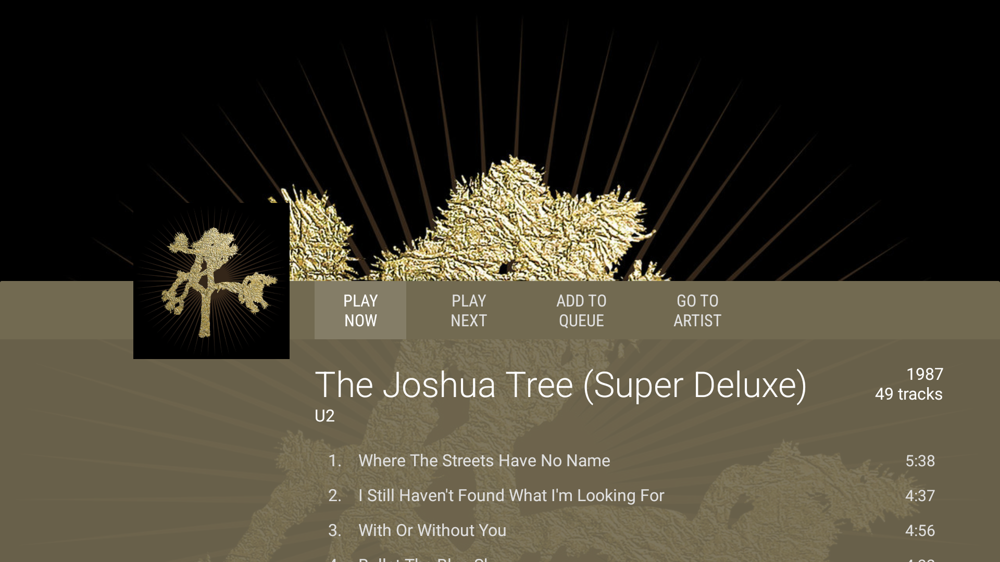
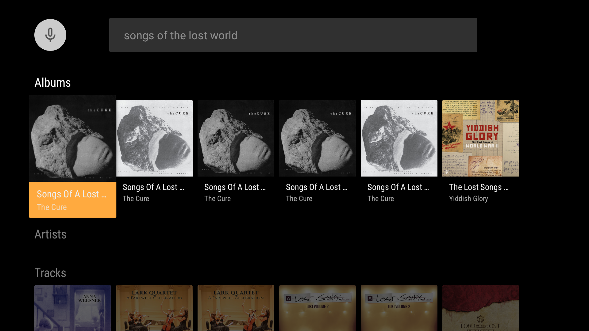

# TIDAL Steamer TV

TIDAL Streamer TV is an Android TV / Google TV application that allows you to browse and play your TIDAL collection to your TIDAL connect devices. This application cannot play music on your TV speakers.

In order to do that, it relies on [tidal_streamer](https://github.com/nbonamy/tidal_streamer), a little server application that exposes a set of API used to browse contents from your TIDAL account.

## Setup

The first thing to do is to install `tidal_streamer` on a computer/server somewhere. Configuration instructions are provided on the project page.

For now, no build is provided so you need to have Android Studio to compile the application and deploy it to your TV. Prior to that, you need to update `app/src/java/fr/bonamy/tidalstreamer/api/ApiRetrofitClient.kt` with the IP address of your `tidal_streamer` server.

## Screenshots

## TODO

- [ ] Auto-discovery of `tidal_streamer`
- [ ] Music playback view
